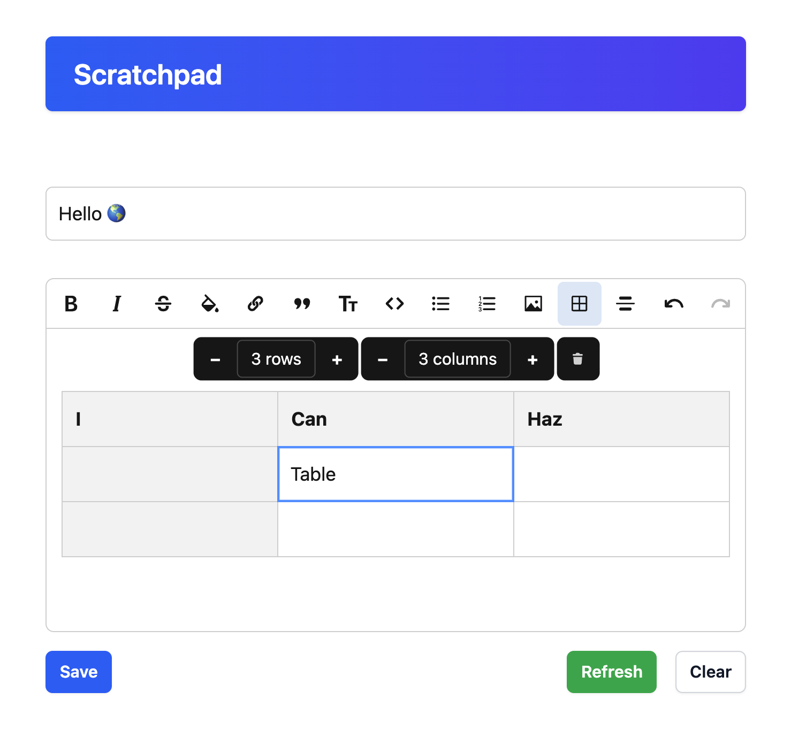
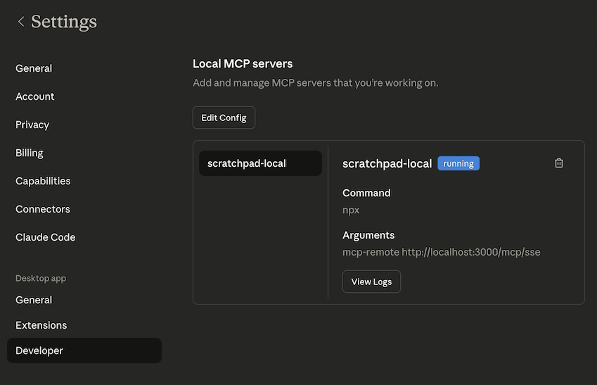
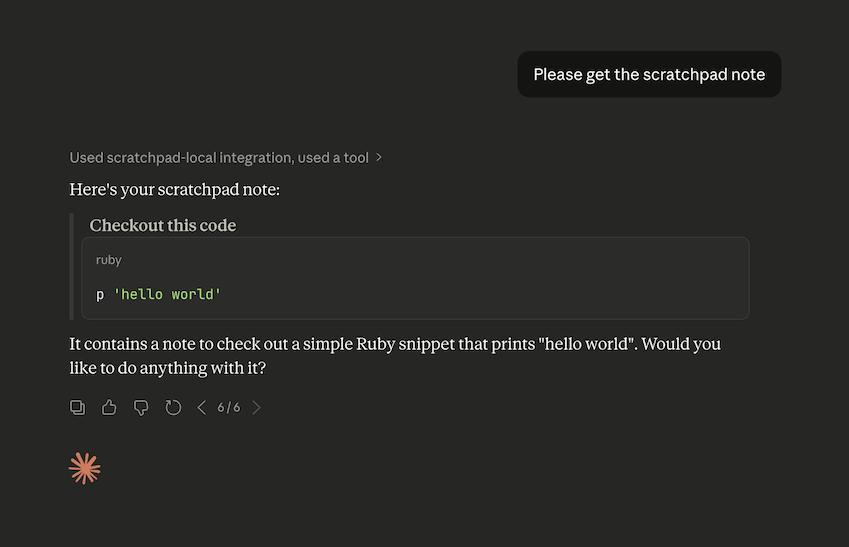

# Scratchpad — minimal collaborative note app



---

A small Rails 8.1 application that demonstrates a collaborative single-note "scratchpad" using:
- Hotwire (Turbo + Stimulus)
- Action Cable for real-time updates
- Action Text (Lexxy) for rich text editing
- Tailwind CSS (via `tailwindcss-rails`) and `importmap-rails` (no Node runtime required)

---

## Features ✅

- Single collaborative note (seeded at `db/seeds.rb`).
- Rich-text editor (Lexxy / Action Text) and live broadcasting via Action Cable.
- Rails 8.1, Ruby 4.0.1, SQLite (local DB for development).
- Security & linting configured: `brakeman`, `bundler-audit`, `rubocop` and CI workflow.
- MCP Server (experimental)

---

## Quick start — development (macOS)

Prerequisites:
- Ruby: **4.0.1** (see `.ruby-version`)
- SQLite3 (local DB used)
- Bundler (Bundler is used from the RubyGems bundle)

Steps:

1. Clone and enter the repo
   ```bash
   git clone https://github.com/JavaKoala/scratchpad.git
   cd scratchpad
   ```
2. Install gems and prepare DB (recommended)
   ```bash
   bin/setup --skip-server  # installs deps, prepares DB
   ```
3. Start in development (hot reload + Tailwind watcher)
   ```bash
   bin/dev  # uses Procfile.dev (web + tailwindcss:watch)
   ```
4. Open the app: http://localhost:3000 (root routes to the scratchpad)

Notes:
- `bin/setup` runs `bin/rails db:prepare` and will seed the single `Note` record.
- The editor content is stored with Action Text (rich text) and Active Storage (local by default).

---

## Tests & linters

- Run the test suite:
  ```bash
  bundle exec rspec
  ```

- Run CI
  ```bash
  bin/ci
  ```
---

## Docker (production image)

Build and run (example):

```bash
# build
docker build -t scratchpad .

# run (RAILS_MASTER_KEY required if credentials are used)
docker run -p 3000:3000 -e RAILS_MASTER_KEY=$RAILS_MASTER_KEY scratchpad
```

The repository includes a production-ready `Dockerfile`.

---

## Important files / where to look 🔎

- `app/models/note.rb` — model (uses `has_rich_text :content`)
- `app/views/notes/index.html.erb` — main UI for the scratchpad
- `app/javascript/` — Stimulus controllers + `lexxy` import
- `config/importmap.rb` — ESM imports used by the app
- `Procfile.dev` / `bin/dev` — development startup
- `Dockerfile`, `.github/workflows/ci.yml` — deployment/CI helpers

---

## Deployment & environment

- Uses local disk for Active Storage by default (`config/storage.yml`).
- For production, set `RAILS_MASTER_KEY` and a persistent database/storage.
- The app is ready to be containerized; see `Dockerfile` for production build steps.

---

## MCP Server (experimental)

Add the following to your Claude desktop configuration, including your server url

```
{
  "mcpServers": {
    "scratchpad-local": {
      "command": "npx",
      "args": [
        "mcp-remote",
        "http://localhost:3000/mcp/sse"
      ]
    }
  },
  ...other settings
}
```


Then ask Claude to get your note



---

## Contributing

- Open issues or PRs. Follow RuboCop rules where applicable.
- Run the linters and tests before submitting changes.

---

## License

This project is licensed under the `MIT` License — see the `LICENSE` file.
